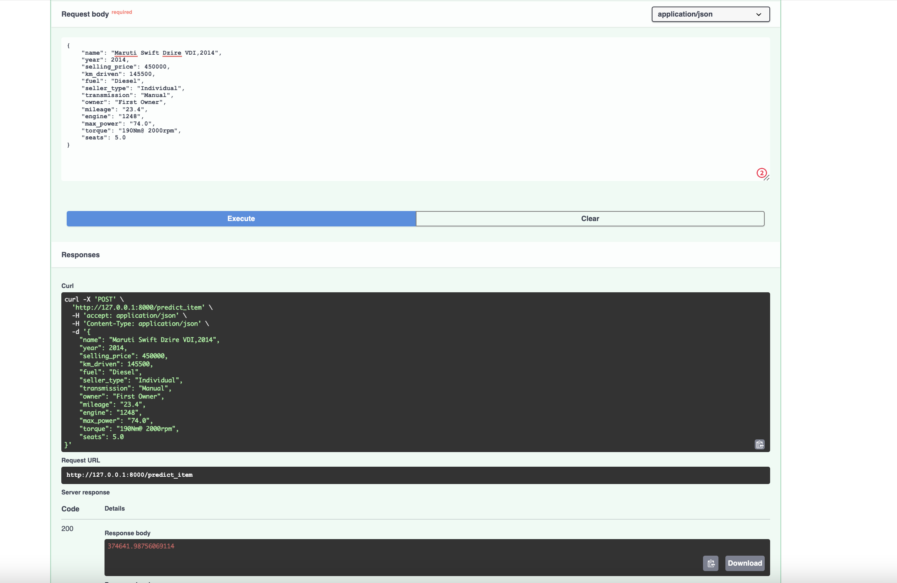
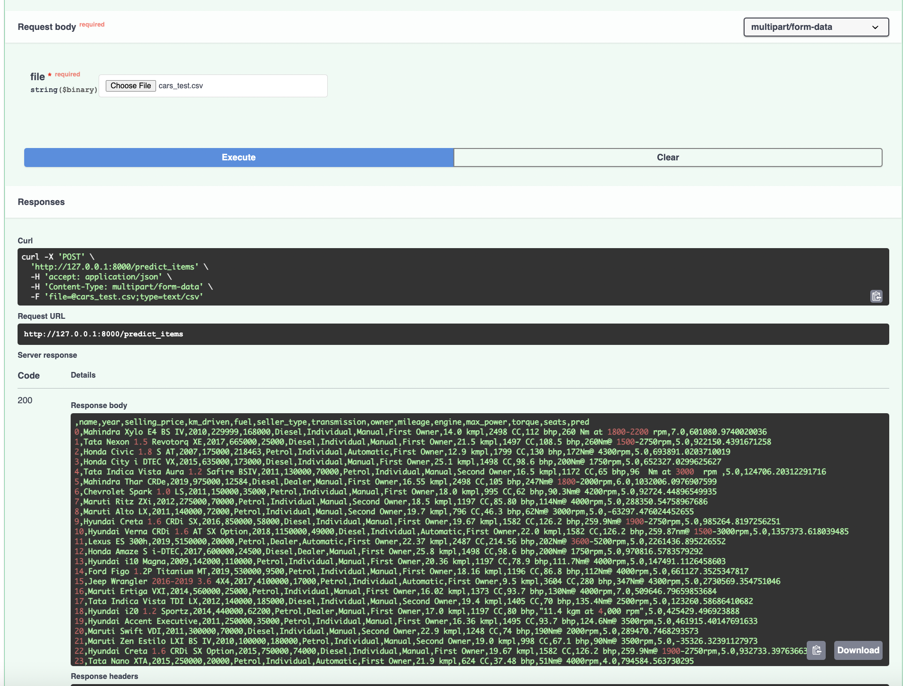

## Простейший EDA и обработка признаков

- отобразил 10 случайных объектов
- отобразил первые и последние 5 объектов
- посчитал основные характеристики численных и не численных признаков
- нашел пропуски в колонках  mileage engine max_power torque seats
- нашел 1159 и отобразил объектов дубликатов
- удалил дубликаты
- ресетнул индексы
- удалил единицы измерения и привел к числам колонки 'mileage','engine','max_power'
- удалил единицы измерения и привел к числам  колонку torque (чтобы это не было)
- заполнил медианами пропуски
- привел engine и seats к инту
- ответил на вопрос про сиденья

## Визуализации
- Отрисовал попарные распредлени числовых признаков трейна
- - Корреляция с целевой переменной есть небольшая у torque max_power и engine
- - Между собой хорошо коррелируют torque max_power и engine
- Отрисовал тоже самое на тесте
- - Не совсем похожи. Параметры max_torque_rpm seats и km_driven по графикам сильно не похожи
- Ответил на вопросы из задания 
- - year - engine
- -  torque - max_power
- - данные говорят что да
- Нарисовал диаграмму рассеиввания torque и max_power
- Дополнительно нарисовал самую негативную коррелияцию и саммую большую по модулю между фичей и таргетом

## Модель только на вещественных признаках
- Разделил на трейн и тест
- обучил дефолтный линрег 
> mse train: 114063748705.0795

> r2 train: 0.6020638782706607

> mse test: 230887614184.30038

> r2 test: 0.5983365615372733

- нормализуем признаки и сделаем тоже самое

>mse train: 114063748705.07945

> r2 train: 0.6020638782706609

> mse test: 230887614184.29855

>r2 test: 0.5983365615372764
- max_power самый информативный признак

- попробовал lasso регрессию. Регуляризация ничего не занулила из-за большого таргета
>mse train: 114063748718.63806

>r2 train: 0.6020638782233587

>mse test: 230888363515.73926

>r2 test: 0.5983352579634833
- перебрал гридсерчем 10000 альф и нашел что оптимальная 22441, обучив 100000 моделей
- занулились 'mileage','engine','seats' 
>mse train: 116455288534.13548

>r2 train: 0.5937204729789722

>mse test: 247377668480.25113

>r2 test: 0.5696496528334498
- запустил гридсерч для эластикнет. лучшая альфа 0.3
>mse train: 116720515245.13026

>r2 train: 0.5927951720840736

>mse test: 250485088048.24683

>r2 test: 0.5642438330676862

## Добавляем категориальные фичи

- Из df_train удалил столбцы с целевой переменной и названием автомобиля.
- Закодировал категориалльные фичи и seats методом OHE
- Запустил ридж регрессию
>mse train: 89505661275.89127

>r2 train: 0.6877400916128057

>mse test: 204776727536.76044

>r2 test: 0.6437603429263857

- Добавил 2 новые фичи, квадрат года и пробега
- прогнал гридсерч на ридже
> mse train: 89453187749.79599

> r2 train: 0.6879231568873112

> mse test: 204324523725.65994

> r2 test: 0.6445470188955331
- сохранил в огурчики модель, скейлер, оне и гридсерч

- написал сервис на fast api 

## финал

- наибольший буст дало добавление категориальных фичей
- не получилось дотянуть модель до более хорошего качества
- не получилось нагенерить много новых фичей потому-что трудно
- не получилось понять прикол из награды

- было очень сложно, я очень устал(